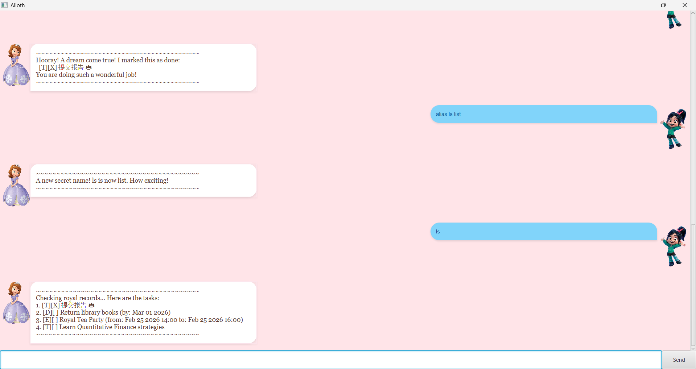

# Alioth User Guide



Alioth is a charming, princess-themed chatbot designed to help you manage your daily tasks with grace and efficiency. Whether you are tracking deadlines or planning a royal ball, Alioth ensures your "Royal Records" are always in order.

## Adding Todo tasks: `todo`

Adds a simple task without any date or time constraints to your royal records.

Example: `todo Bake royal cake`
```
Whistle while you work! I have added this task:
[T][ ] Bake royal cake
Now your kingdom has 1 tasks to complete!
```

## Adding Deadlines: `deadline`

Adds a task that must be completed by a specific date. Alioth uses a standardized format to ensure you aren't late for the ball!

Example: `deadline Return library books /by 2026-03-01`
```
Whistle while you work! I have added this task:
[D][ ] Return library books (by: Mar 01 2026)
Now your kingdom has 2 tasks to complete!
```

## Adding Events: `event`

Adds a task with a specific start and end time. Perfect for scheduling tea parties or study sessions.

Example: `event Royal Tea Party /from 2026-02-25 1400 /to 2026-02-25 1600`
```
Whistle while you work! I have added this task:
[E][ ] Royal Tea Party (from: Feb 25 2026 14:00 to: Feb 25 2026 16:00)
Now your kingdom has 3 tasks to complete!
```

## Creating Shortcuts: `alias`

Allows you to create a "secret name" for any command to work faster.

Example: `alias ls list`
```
A new secret name! ls is now list. How exciting!
```

## Listing Records: `list`

Displays all the tasks currently saved in your royal records.

Example: `list`
```
Checking royal records... Here are the tasks:
1. [T][X] 提交报告 👑
2. [D][ ] Return library books (by: Mar 01 2026)
3. [E][ ] Royal Tea Party (from: Feb 25 2026 14:00 to: Feb 25 2026 16:00)
4. [T][ ] Learn Quantitative Finance strategies
```

## Marking Tasks: `mark`

Marks a task as completed once you have finished it.

Example: `mark 1`
```
Hooray! A dream come true! I marked this as done:
[T][X] 提交报告 👑
You are doing such a wonderful job!
```

## Unmarking Tasks: `unmark`

Changes a task's status back to "not done" if you need to revisit it.

Example: `unmark 1`
```
Oh! I have marked this task as not done yet:
[T][ ] 提交报告 👑
```

## Searching Tasks: `find`

Searches your records for tasks containing a specific keyword.

Example: `find book`
```
I found these matching tasks in the garden:
1. [D][ ] Return library books (by: Mar 01 2026)
```

## Viewing Shortcuts: `aliases`

Displays all current secret names and the commands they represent.

Example: `aliases`
```
Royal Secret Names:
* roti -> list
* jjsj -> bye
```

## Removing Shortcuts: `unalias`

Removes a specific secret name when you no longer need the shortcut.

Example: `unalias jjsj`
```
The magic is gone! jjsj is no longer a secret name.
```

## Deleting Tasks: `delete`

Removes a task from your list permanently.

Example: `delete 1`
```
Let it go! I have removed this task for you:
[T][X] 提交报告 👑
Your path is clearer now with 3 tasks left.
```

## Exiting: `bye`

Closes the Alioth application.

Example: `bye`
```
Goodbye for now! I hope all your dreams come true!
Come back to the castle soon!
```
